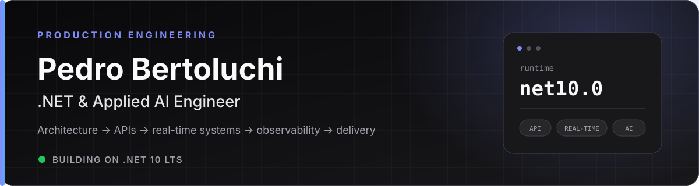

# Pedro Bertoluchi

**.NET & Applied AI Engineer.** I build production-grade .NET systems and applied-AI workflows—from architecture and APIs to observability and delivery. I care most about what happens after the demo: security, reliability, and maintainable operations.

[Portfolio](https://www.bertoluchi.dev/en) · [Technical writing](https://www.bertoluchi.dev/en/blog) · [GitHub](https://github.com/PedroBertoluchi) · [LinkedIn](https://www.linkedin.com/in/pedro-bertoluchi/) · [Email](mailto:pedro.bertoluchi@outlook.com)

> Production over demos. Observability before guesswork. AI when it earns the complexity.

## What I build

- **Product systems** — ASP.NET Core and Blazor applications designed from the domain outward.
- **Platforms and integration** — secure APIs, gateways, identity, data workflows, and real-time features with SignalR.
- **Applied AI and automation** — RAG, semantic search, AI-assisted workflows, and background services tied to real operational needs.
- **Delivery foundations** — secure defaults, CI/CD, telemetry, documentation, and runbooks that make systems easier to own.

## Core stack

- **Application:** C# · .NET 10 · ASP.NET Core · Blazor · SignalR · Entity Framework Core
- **Data:** SQL Server · Azure SQL · PostgreSQL · Redis · RabbitMQ · SQLite
- **Cloud & operations:** Azure · API Management · Microsoft Entra ID · Application Insights · GitHub Actions
- **Applied AI:** OpenAI · Azure OpenAI · Semantic Kernel · embeddings · RAG
- **Beyond the core:** .NET MAUI · WPF · Windows Forms · C++ · Lua

## Field notes

- [When not to use RAG](https://www.bertoluchi.dev/en/blog/when-not-to-use-rag) — choosing simpler retrieval patterns when RAG does not earn its complexity.
- [End-to-end observability for .NET APIs with OpenTelemetry](https://www.bertoluchi.dev/en/blog/observability-aspnet-opentelemetry) — connecting traces, metrics, and logs around production behavior.
- [The outbox pattern in .NET](https://www.bertoluchi.dev/en/blog/outbox-pattern-dotnet-masstransit) — making message delivery reliable beyond a happy-path demo.
